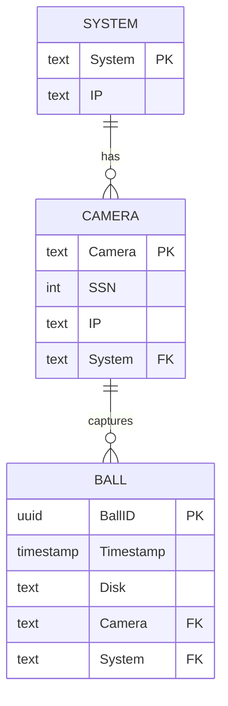

# ScyllaDB Schema Diagram

```mermaid
erDiagram
    SYSTEM {
        text System PK
        text IP
    }
    CAMERA {
        text Camera PK
        int SSN
        text IP
        text System FK
    }
    BALL {
        uuid BallID PK
        timestamp Timestamp
        text Disk
        text Camera FK
        text System FK
    }

    SYSTEM ||--o{ CAMERA : "has"
    CAMERA ||--o{ BALL : "captures"
```
